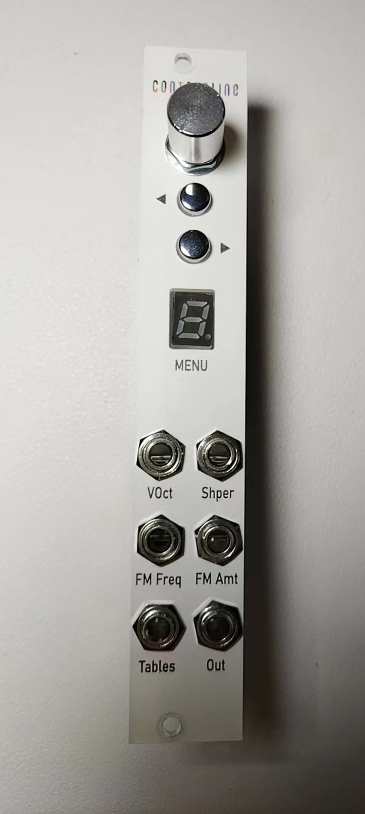

ContourLine Arduino DCO

The Eurorack modular is based on the Arduino-Mozzi library.

简介

欢迎使用 ContourLine，这是一款开源的 Eurorack 数字振荡器。该振荡器基于**Arduino Nano 控制器**与**Mozzi 库**开发，通过简洁的硬件设计与丰富的软件功能，实现多样化的音频合成效果。

用户可通过两个按钮切换旋钮调节功能与参数列表，并借助 8 位数码管实时显示当前设置。参数修改采用 "接近解锁" 机制：当旋钮调节至目标参数附近时，数码管亮度提升，即表示该参数已解锁可编辑状态。

项目已提供完整的 Gerber 文件、BOM 清单及物料列表。若需定制 PCB 板，可参考 B 站用户 ciiyte 发布的教程，通过嘉立创等厂商完成制作。

模块参数

| 项目&#xA;          | 参数规格&#xA;                                   |
| ---------------- | ------------------------------------------- |
| 电源接口&#xA;        | 10 针连接器&#xA;                                |
| +12V 功耗&#xA;     | 约 25mA&#xA;                                 |
| -12V 功耗&#xA;     | 约 5mA&#xA;                                  |
| Eurorack 规格&#xA; | 4HP 宽度，30mm 深度&#xA;                         |
| 操作部件&#xA;        | 1 个旋钮，2 个按钮，1 个 8 位数码管&#xA;                 |
| 信号接口&#xA;        | 1x VOCT 输入，3x CV 输入，1x Gate 输入，1x 音频输出&#xA; |

硬件设计

1.  **核心控制**：采用 Arduino Nano 控制器，内置 8 路 ADC 输入通道，可直接兼容 Eurorack 标准的 0-5V 控制信号，无需额外放大电路，大幅简化 PCB 设计。

2.  **交互设计**：通过按钮切换菜单、单旋钮调整参数、数码管显示状态的设计方案，在保持硬件简洁性的同时，具备良好的功能扩展性，支持未来参数与调制功能的升级。

3.  **信号处理**：针对不同类型的 CV 信号（低频控制、音频、VOCT、门控信号等），采用差异化电路设计，确保信号处理的准确性与稳定性。

现有程序实现

项目已开发多种音频合成算法，涵盖振荡器、打击乐发生器、采样器等功能模块，具体包括：

*   [Avr-wt-synth 故障振荡器](Software/Avr-wt-synth/readme.md)

*   [虚拟模拟振荡器](Software/AnalogWave/readme.md)

*   [可调制打击乐发生器](Software/DrumVoltrixion/readme.md)

*   [和弦 / 加法 / FM 振荡器](Software/FmAddChordDCO/readme.md)

*   [2 算子 FM 振荡器（入门）](Software/FmDCO/readme.md)

*   [波型渐变 2 算子 FM 振荡器（推荐）](Software/FmWsWtDCO/readme.md)

*   [波型渐变 2 算子 FM 振荡器（lofi 版）](Software/FmWsWtDCOfor168p/readme.md)

*   [4 组打击乐发生器](Software/FourTrekPerc/readme.md)

*   [粒子合成器](Software/Granular/readme.md)

*   [和谐音程振荡器](Software/HarmonicOSC/readme.md)

*   [风噪音发生器](Software/NoiseWindy/readme.md)

*   [4K 采样器](Software/Sampler/readme.md)

*   [失谐振荡器](Software/Swarmduino/readme.md)

更多程序详见：[软件仓库](https://github.com/lechenghhh/ContourLine/tree/master/Software)

程序拓展说明

### 技术原理&#xA;

本项目基于**Mozzi 库**开发。Arduino Nano 虽无内置 DAC 模块，但通过 PWM（脉宽调制）结合 RC 滤波电路，依据奈奎斯特采样定理，在高采样率下实现高质量音频输出。

### 主程序结构（以波型渐变 2 算子 FM 振荡器为例）&#xA;

1.  **setup()**：初始化控制引脚、数码管引脚配置，启动 Mozzi 库运行环境。

2.  **updateControl()**：实时获取菜单状态、旋钮参数、按钮输入及 CV 信号数据，经运算生成音频合成基础参数。

3.  **updateAudio()**：执行核心音频合成算法，输出 PWM 格式音频信号。该函数为实时音频处理模块，严禁包含复杂控制逻辑。

4.  **loop()**：调用 Mozzi 库的`audioHook()`函数，请勿修改此部分代码以确保音频处理的实时性。

如需技术讨论或功能建议，欢迎访问：[项目讨论区](https://github.com/environscape/ContourLine/issues)

> （注：文档部分内容可能由 AI 生成）
>
